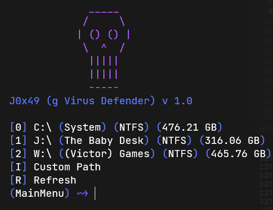

# anti-grename-virus v1.0

This code is an antivirus for g rename virus in windows, it detects and remove the virus and recover infected files and rename it.

# Screenshot

# Want the source code?

Contact me at [telegram](https://t.me/j0x49) to get the source code for free **Signed Agreement Required**. 
